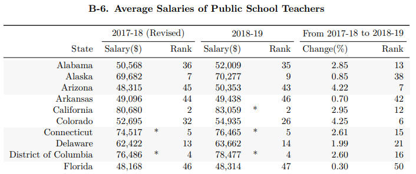
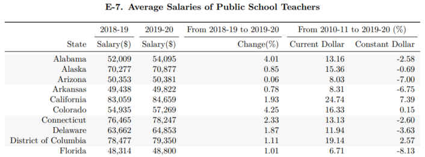

After reading a news article about teacher pay in the US, I was curious and wanted to look into the source data myself. Unfortunately, the source that was mentioned was a publication by the [National Education Association (NEA)](https://www.nea.org/) which had the data as tables embedded inside a PDF report. As those who know me can attest, I don't like hand-copying data. It is slow and error-prone. Instead, I decided to use the tabula package to extract the information from the PDFs directly into a Pandas dataframe. In this post, I will show you how to extract the data and how to clean it up for analysis.

{}

## The Data Source

Several years worth of data are available in PDF form on the [NEA website](https://www.nea.org/research-publications). Reading through the technical notes, they highlight that they did not collect all of their own salary information. Some states' information is calculated from the American Community Survey (ACS) done by the Census Bureau - a great resource whose API I have covered in a [different post](). Each report includes accurate data for the previous school year, as well as estimates for the current school year. As of this post, the newest report is the 2020 report which includes data for the the 2018-2019 school year, as well as estimates of the 2019-2020 school year.

The 2020 report has the desired teacher salary information in two separate locations. One is in table B-6 on page 26 of the PDF, which shows a ranking of the different states' average salary in addition to the average salary:



A second location is in table E-7 on page 46, which gives salary data for the completed school year as well as different states' estimates for the 2019-2020 school year:



Note that table E-7 lacks the star-annotation marking NEA estimated values. This, and the lack of the ranking column, makes Table E-7 easier to parse. In the main example below, this will be the source of the five years of data. I will however also show how to parse table B-6 at the end of this post for completion. 

## Loading the Data

As of October 2020, the NEA site has five years worth of reports online. Unfortunately, these are not labeled consistently for all five years. Similarly the page numbers differ for each report. Prior to the 2018 report, inconsistent formats were used for the tables which require previous years to be parsed separately from the newer tables. For this reason, I'll make a dictionary for the 2018-2020 reports only, which will simplify the example below.


```python
report = {
    '2020' : {
        'url'  : "https://www.nea.org/sites/default/files/2020-10/2020%20Rankings%20and%20Estimates%20Report.pdf",
        'page' : 46,
    },
    '2019' : {
        'url'  : "https://www.nea.org/sites/default/files/2020-06/2019%20Rankings%20and%20Estimates%20Report.pdf",
        'page' : 49,
    },
    '2018' : {
        'url'  : "https://www.nea.org/sites/default/files/2020-07/180413-Rankings_And_Estimates_Report_2018.pdf",
        'page' : 51,
    },
}
```

We can now use dictionary comprehension to fill in a dictionary with all the source tables of interest. We will be using the tabula package to extract data from the PDFs. If you don't have it installed, you can use `pip install tabula-py` to get a copy. The method that reads in a PDF is aptly called `read_pdf`. It's first argument is a file path to the PDF. Since we want to use a URL, we will use the keyword argument `stream=True` and then name the specific page in each PDF that contains the information we are after. By default, `read_pdf` returns a list of dataframes, so we just save the first element from the list, which is the report we are interested in.

*Note:* if you are using WSL, depending on your settings, you may get the error `Exception in thread "main" java.awt.AWTError: Can't connect to X11 window server using 'XXX.XXX.XXX.XXX:0' as the value of the DISPLAY variable.` error when running `read_pdf`. This is fixed by having an X11 server running.


```python
import tabula
import pandas as pd

source_df = {year : tabula.read_pdf(report[year]['url'], stream=True, pages=report[year]['page'])[0] 
             for year in report.keys()}
```

And that's it in principle. How cool is that! Of course, we still need to clean our data a little bit. 

### Cleaning the Data

Let's take a look at the first and last few entries of the 2020 report:


```python
pd.concat([source_df['2020'].head(), 
           source_df['2020'].tail()])
```


<div>
<style scoped>
    .dataframe tbody tr th:only-of-type {
        vertical-align: middle;
    }

    .dataframe tbody tr th {
        vertical-align: top;
    }

    .dataframe thead th {
        text-align: right;
    }
</style>
<table border="1" class="dataframe">
  <thead>
    <tr style="text-align: right;">
      <th></th>
      <th>Unnamed: 0</th>
      <th>2018-19</th>
      <th>2019-20</th>
      <th>From 2018-19 to 2019-20</th>
      <th>From 2010-11 to 2019-20 (%)</th>
    </tr>
  </thead>
  <tbody>
    <tr>
      <th>0</th>
      <td>State</td>
      <td>Salary($)</td>
      <td>Salary($)</td>
      <td>Change(%)</td>
      <td>Current Dollar Constant Dollar</td>
    </tr>
    <tr>
      <th>1</th>
      <td>Alabama</td>
      <td>52,009</td>
      <td>54,095</td>
      <td>4.01</td>
      <td>13.16 -2.58</td>
    </tr>
    <tr>
      <th>2</th>
      <td>Alaska</td>
      <td>70,277</td>
      <td>70,877</td>
      <td>0.85</td>
      <td>15.36 -0.69</td>
    </tr>
    <tr>
      <th>3</th>
      <td>Arizona</td>
      <td>50,353</td>
      <td>50,381</td>
      <td>0.06</td>
      <td>8.03 -7.00</td>
    </tr>
    <tr>
      <th>4</th>
      <td>Arkansas</td>
      <td>49,438</td>
      <td>49,822</td>
      <td>0.78</td>
      <td>8.31 -6.75</td>
    </tr>
    <tr>
      <th>48</th>
      <td>Washington</td>
      <td>73,049</td>
      <td>72,965</td>
      <td>-0.11</td>
      <td>37.86 18.69</td>
    </tr>
    <tr>
      <th>49</th>
      <td>West Virginia</td>
      <td>47,681</td>
      <td>50,238</td>
      <td>5.36</td>
      <td>13.51 -2.28</td>
    </tr>
    <tr>
      <th>50</th>
      <td>Wisconsin</td>
      <td>58,277</td>
      <td>59,176</td>
      <td>1.54</td>
      <td>9.17 -6.02</td>
    </tr>
    <tr>
      <th>51</th>
      <td>Wyoming</td>
      <td>58,861</td>
      <td>59,014</td>
      <td>0.26</td>
      <td>5.19 -9.44</td>
    </tr>
    <tr>
      <th>52</th>
      <td>United States</td>
      <td>62,304</td>
      <td>63,645</td>
      <td>2.15</td>
      <td>14.14 -1.73</td>
    </tr>
  </tbody>
</table>
</div>


We see that each column is treated as a string object (which you can confirm by running `source_df['2020'].dtypes`) and that the first row of data is actually at index 1 due to the fact that the PDF report used a two-row header. This means we can safely drop the first row of every dataframe. We can also drop the last row of every dataframe since that just contains summary data of the US as a whole, which we can easily regenerate as necessary. So row indices 0 and 52 can go for all of our data sets.


```python
for df in source_df.values():
    df.drop([0, 52], inplace=True)
```

Next up I'd like to fix the column names. The fist column is clearly the name of the state (except in the case of Washington D.C.), while the next two columns give the years for which the salary information is given. Let's rename the second and third columns according to the pattern `Salary %YYYY-YY` using Python's f-string syntax.


```python
for df in source_df.values():
    df.rename(columns={
        df.columns[0] : "State",
        df.columns[1] : f"Salary {str(df.columns[1])}",
        df.columns[2] : f"Salary {str(df.columns[2])}",
    }, 
              inplace=True)
    
source_df["2020"].head()  # show the result of our edits so far
```


<div>
<style scoped>
    .dataframe tbody tr th:only-of-type {
        vertical-align: middle;
    }

    .dataframe tbody tr th {
        vertical-align: top;
    }

    .dataframe thead th {
        text-align: right;
    }
</style>
<table border="1" class="dataframe">
  <thead>
    <tr style="text-align: right;">
      <th></th>
      <th>State</th>
      <th>Salary 2018-19</th>
      <th>Salary 2019-20</th>
      <th>From 2018-19 to 2019-20</th>
      <th>From 2010-11 to 2019-20 (%)</th>
    </tr>
  </thead>
  <tbody>
    <tr>
      <th>1</th>
      <td>Alabama</td>
      <td>52,009</td>
      <td>54,095</td>
      <td>4.01</td>
      <td>13.16 -2.58</td>
    </tr>
    <tr>
      <th>2</th>
      <td>Alaska</td>
      <td>70,277</td>
      <td>70,877</td>
      <td>0.85</td>
      <td>15.36 -0.69</td>
    </tr>
    <tr>
      <th>3</th>
      <td>Arizona</td>
      <td>50,353</td>
      <td>50,381</td>
      <td>0.06</td>
      <td>8.03 -7.00</td>
    </tr>
    <tr>
      <th>4</th>
      <td>Arkansas</td>
      <td>49,438</td>
      <td>49,822</td>
      <td>0.78</td>
      <td>8.31 -6.75</td>
    </tr>
    <tr>
      <th>5</th>
      <td>California</td>
      <td>83,059</td>
      <td>84,659</td>
      <td>1.93</td>
      <td>24.74 7.39</td>
    </tr>
  </tbody>
</table>
</div>


Looks like we're almost done! Let's drop the unnecessary columns and check our remaining column names:


```python
for year, df in source_df.items():
    df.drop(df.columns[3:], axis=1, inplace=True)
    print(f"{year}:\t{df.columns}")
```

    2020:	Index(['State', 'Salary 2018-19', 'Salary 2019-20'], dtype='object')
    2019:	Index(['State', 'Salary 2017-18', 'Salary 2018-19'], dtype='object')
    2018:	Index(['State', 'Salary 2017', 'Salary 2018'], dtype='object')


We can see that the column naming scheme in 2018 was different than in the previous reports. To make them all compatible for our merge, we're going to have to do some more editing. Based on the other reports, it appears as though the 2018 report used the calendar year of the *end* of the school year, while the others utilized a range. This can easily be solved using regex substitution. We'll do that now.


```python
import re

for year, df in source_df.items():
    if year != "2018":
        df.rename(columns={
            df.columns[1] : re.sub(r"\d{2}-", '', df.columns[1]),
            df.columns[2] : re.sub(r"\d{2}-", '', df.columns[2]),
        }, 
                  inplace=True)
    # print the output for verification
    print(f"{year}:\t{df.columns}")
```

    2020:	Index(['State', 'Salary 2019', 'Salary 2020'], dtype='object')
    2019:	Index(['State', 'Salary 2018', 'Salary 2019'], dtype='object')
    2018:	Index(['State', 'Salary 2017', 'Salary 2018'], dtype='object')


Now that everything works, we can do our merge to create a single dataframe with the information for all of the school years we have downloaded.


```python
merge_df = source_df["2018"].drop(["Salary 2018"], axis=1).merge(
                    source_df["2019"].drop(["Salary 2019"], axis=1)).merge(
                    source_df["2020"])

merge_df.head()
```


<div>
<style scoped>
    .dataframe tbody tr th:only-of-type {
        vertical-align: middle;
    }

    .dataframe tbody tr th {
        vertical-align: top;
    }

    .dataframe thead th {
        text-align: right;
    }
</style>
<table border="1" class="dataframe">
  <thead>
    <tr style="text-align: right;">
      <th></th>
      <th>State</th>
      <th>Salary 2017</th>
      <th>Salary 2018</th>
      <th>Salary 2019</th>
      <th>Salary 2020</th>
    </tr>
  </thead>
  <tbody>
    <tr>
      <th>0</th>
      <td>Alabama</td>
      <td>50,391</td>
      <td>50,568</td>
      <td>52,009</td>
      <td>54,095</td>
    </tr>
    <tr>
      <th>1</th>
      <td>Alaska</td>
      <td>6 8,138</td>
      <td>69,682</td>
      <td>70,277</td>
      <td>70,877</td>
    </tr>
    <tr>
      <th>2</th>
      <td>Arizona</td>
      <td>4 7,403</td>
      <td>48,723</td>
      <td>50,353</td>
      <td>50,381</td>
    </tr>
    <tr>
      <th>3</th>
      <td>Arkansas</td>
      <td>4 8,304</td>
      <td>50,544</td>
      <td>49,438</td>
      <td>49,822</td>
    </tr>
    <tr>
      <th>4</th>
      <td>California</td>
      <td>7 9,128</td>
      <td>80,680</td>
      <td>83,059</td>
      <td>84,659</td>
    </tr>
  </tbody>
</table>
</div>


### Numeric Conversion

We're almost done! Notice that we still have not dealt with the fact that every column is still treated as a string. Before we can use the `to_numeric` function, we still need to take care of two issues:

- The commas in the numbers. While they are nice for our human eyes, Pandas doesn't like them.
- In the 2017 salary column, there appears to be extraneous white space after the first digit for some entries.

Luckily, both of these problems can be remedied with a simple string replacement operation.


```python
merge_df.iloc[:,1:] = merge_df.iloc[:,1:].replace(r"[,| ]", '', regex=True)

for col in merge_df.columns[1:]:
    merge_df[col] = pd.to_numeric(merge_df[col])
```

Now we're done! We have created an overview of annual teacher salaries from the 2016-17 school year until 2019-20 extracted from a series of PDFs published by the NEA. We have cleaned up the data and converted everything to numerical values. We can now get summary statistics and do any analysis of interest with this data.


```python
merge_df.describe() # summary stats of our numeric columns
```


<div>
<style scoped>
    .dataframe tbody tr th:only-of-type {
        vertical-align: middle;
    }

    .dataframe tbody tr th {
        vertical-align: top;
    }

    .dataframe thead th {
        text-align: right;
    }
</style>
<table border="1" class="dataframe">
  <thead>
    <tr style="text-align: right;">
      <th></th>
      <th>Salary 2017</th>
      <th>Salary 2018</th>
      <th>Salary 2019</th>
      <th>Salary 2020</th>
    </tr>
  </thead>
  <tbody>
    <tr>
      <th>count</th>
      <td>51.000000</td>
      <td>51.000000</td>
      <td>51.000000</td>
      <td>51.000000</td>
    </tr>
    <tr>
      <th>mean</th>
      <td>56536.196078</td>
      <td>57313.039216</td>
      <td>58983.254902</td>
      <td>60170.647059</td>
    </tr>
    <tr>
      <th>std</th>
      <td>9569.444674</td>
      <td>9795.914601</td>
      <td>10286.843230</td>
      <td>10410.259274</td>
    </tr>
    <tr>
      <th>min</th>
      <td>42925.000000</td>
      <td>44926.000000</td>
      <td>45105.000000</td>
      <td>45192.000000</td>
    </tr>
    <tr>
      <th>25%</th>
      <td>49985.000000</td>
      <td>50451.500000</td>
      <td>51100.500000</td>
      <td>52441.000000</td>
    </tr>
    <tr>
      <th>50%</th>
      <td>54308.000000</td>
      <td>53815.000000</td>
      <td>54935.000000</td>
      <td>57091.000000</td>
    </tr>
    <tr>
      <th>75%</th>
      <td>61038.000000</td>
      <td>61853.000000</td>
      <td>64393.500000</td>
      <td>66366.000000</td>
    </tr>
    <tr>
      <th>max</th>
      <td>81902.000000</td>
      <td>84227.000000</td>
      <td>85889.000000</td>
      <td>87543.000000</td>
    </tr>
  </tbody>
</table>
</div>


## Table B-6

As mentioned above, table B-6 in the 2020 Report presents slightly greater challenges. A lot of the cleaning is similar or identical, so I will not reproduce it in full. Instead, I have loaded a subsetted part of table B-6 and will show how this can be cleaned up as well. But first, let's look at the first several entries:


<div>
<style scoped>
    .dataframe tbody tr th:only-of-type {
        vertical-align: middle;
    }

    .dataframe tbody tr th {
        vertical-align: top;
    }

    .dataframe thead th {
        text-align: right;
    }
</style>
<table border="1" class="dataframe">
  <thead>
    <tr style="text-align: right;">
      <th></th>
      <th>Unnamed: 0</th>
      <th>2017-18 (Revised)</th>
      <th>2018-19</th>
    </tr>
  </thead>
  <tbody>
    <tr>
      <th>0</th>
      <td>State</td>
      <td>Salary($) Rank</td>
      <td>Salary($)</td>
    </tr>
    <tr>
      <th>1</th>
      <td>Alabama</td>
      <td>50,568 36</td>
      <td>52,009</td>
    </tr>
    <tr>
      <th>2</th>
      <td>Alaska</td>
      <td>69,682 7</td>
      <td>70,277</td>
    </tr>
    <tr>
      <th>3</th>
      <td>Arizona</td>
      <td>48,315 45</td>
      <td>50,353</td>
    </tr>
    <tr>
      <th>4</th>
      <td>Arkansas</td>
      <td>49,096 44</td>
      <td>49,438</td>
    </tr>
    <tr>
      <th>5</th>
      <td>California</td>
      <td>80,680 2</td>
      <td>83,059 *</td>
    </tr>
    <tr>
      <th>6</th>
      <td>Colorado</td>
      <td>52,695 32</td>
      <td>54,935</td>
    </tr>
    <tr>
      <th>7</th>
      <td>Connecticut</td>
      <td>74,517 * 5</td>
      <td>76,465 *</td>
    </tr>
    <tr>
      <th>8</th>
      <td>Delaware</td>
      <td>62,422 13</td>
      <td>63,662</td>
    </tr>
  </tbody>
</table>
</div>


We can see that there is an additional hurdle compared to the previous tables: the second column now contains data from two columns, both the Salary information as well as a ranking of the salary as it compares to the different states. For a few states, there is additionally a '\*' to denote values that were estimated as opposed to received. We can again use a simple regex replace together with a capture group to parse out only those values that we are interested in, while dropping the extraneous information using the code below.


```python
b6.iloc[:,1:] = b6.iloc[:,1:].replace(r"([\d,]+).*", r"\1", regex=True)
```

And now we're back to where we were above before we did the string conversion. This is what it looks like after also dropping the first row and renaming the columns:


<div>
<style scoped>
    .dataframe tbody tr th:only-of-type {
        vertical-align: middle;
    }

    .dataframe tbody tr th {
        vertical-align: top;
    }

    .dataframe thead th {
        text-align: right;
    }
</style>
<table border="1" class="dataframe">
  <thead>
    <tr style="text-align: right;">
      <th></th>
      <th>State</th>
      <th>Salary 2018</th>
      <th>Salary 2019</th>
    </tr>
  </thead>
  <tbody>
    <tr>
      <th>1</th>
      <td>Alabama</td>
      <td>50,568</td>
      <td>52,009</td>
    </tr>
    <tr>
      <th>2</th>
      <td>Alaska</td>
      <td>69,682</td>
      <td>70,277</td>
    </tr>
    <tr>
      <th>3</th>
      <td>Arizona</td>
      <td>48,315</td>
      <td>50,353</td>
    </tr>
    <tr>
      <th>4</th>
      <td>Arkansas</td>
      <td>49,096</td>
      <td>49,438</td>
    </tr>
    <tr>
      <th>5</th>
      <td>California</td>
      <td>80,680</td>
      <td>83,059</td>
    </tr>
    <tr>
      <th>6</th>
      <td>Colorado</td>
      <td>52,695</td>
      <td>54,935</td>
    </tr>
    <tr>
      <th>7</th>
      <td>Connecticut</td>
      <td>74,517</td>
      <td>76,465</td>
    </tr>
    <tr>
      <th>8</th>
      <td>Delaware</td>
      <td>62,422</td>
      <td>63,662</td>
    </tr>
  </tbody>
</table>
</div>


From here on out, we can proceed as in the previous example.
