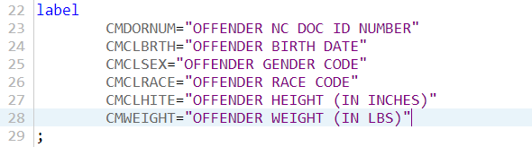
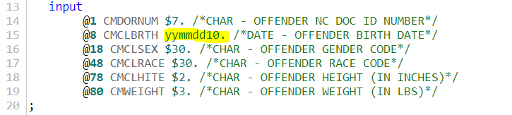

I am currently working with a database provided by the North Carolina Department of Public Safety
that consists of several fixed-width files. Each of these has an associated codebook that gives the
internal variable name, a label of the variable, its data type, as well as the start column and 
the length of the fields for each column. To import the data sets into SAS, I could copy and paste
part of that data into my INPUT and LABEL statements, but that gets tedious pretty fast when dealing
with dozens of lines. And since I have multiple data sets like that, I didn't really want to do it that way. 
In this post I show how a simple command-line script can be written to deal with this problem.

## Introducing AWK
Here are the first few lines of one of these files:

```
CMDORNUM      OFFENDER NC DOC ID NUMBER          CHAR      1       7     
CMCLBRTH      OFFENDER BIRTH DATE                DATE      8       10    
CMCLSEX       OFFENDER GENDER CODE               CHAR      18      30    
CMCLRACE      OFFENDER RACE CODE                 CHAR      48      30    
CMCLHITE      OFFENDER HEIGHT (IN INCHES)        CHAR      78      2     
CMWEIGHT      OFFENDER WEIGHT (IN LBS)           CHAR      80      3     
```

We can see that the data is tabular and separated by multiple spaces. Linux programs often deal
with column data and a tool is available for manipulating column-based data on the command-line:
AWK, a program that can be used for complex text manipulation from the command-line. Some useful
tutorials on AWK in general are available at [grymoire.com](https://www.grymoire.com/Unix/Awk.html)
and at [tutorialspoint](https://www.tutorialspoint.com/awk/index.htm).

For our purposes, we want to know about the `print` and `printf` commands for AWK. To illustrate
how this works, make a simple list of three lines with each term separated by a space:

```bash
 cat << EOF > list.txt
1 one apple pie
2 two orange cake
3 three banana shake
EOF
```
To print the whole file, you'd use the print statement: `awk '{print}' list.txt`. But I could do that with 
`cat`, so what's the point? Well, what if I only want *one* of the columns? By default, `$n` refers to the
*n*th column in AWK. So to print only the fruits I could write `awk '{print $3}' list.txt`.

Multiple columns can be printed by listing multiple columns separated by a comma: 
`awk '{print $2,$3}' list.txt`. Note that if you omit the comma the two columns get concatenated into
a single column.

If additional formatting is required, we can use the `printf` command. So to create a hyphenated
fruit and food-item column, we could use `awk '{printf "%s-%s\n", $3, $4}' list.txt`. Note that we
have to indicate the end-of line or else everything will be printed into a single line of text.

Now we almost have all of the skills to create the label and input statements in SAS! Let's create
a comma-delimited list for practice:

```bash
cat << EOF > list.txt
1,one,apple pie
2,two,orange cake
3,three,banana shake
EOF
```

The `-F` flag is used to tell AWK to use a different column separator. So to print the
third column, we'd use `awk -F ',' '{print $3}' list.txt`.

## Making the SAS statements
Now we know everything we need to know about AWK to create code we want. First we note that
our coding file uses multiple spaces as column separators as opposed to single spaces. If
each item was a single word, this wouldn't be a problem. Unfortunately, our second column
reads "OFFENDER NC DOC ID NUMBER" which would be split into five columns by default. So we 
will need to use the column separator flag as `-F '[[:space:]][[:space:]]+'`.


### The LABEL Statement

A SAS label has the [general form](https://documentation.sas.com/doc/en/pgmsascdc/v_011/lestmtsref/n1r8ub0jx34xfsn1ppcjfe0u16pc.htm) 
`LABEL variable-1=label-1<...variable-n=label-n>;`, so for example

```SAS
label score1="Grade on April 1 Test"  
      score2="Grade on May 1 Test";
```

is a valid label statement. In our file the variable names are given in column 1
and the appropriate labels in column 2. So an AWK script to print the appropriate
labels can be written like this:

```bash
awk -F '[[:space:]][[:space:]]+' '{printf "\t%s=\"%s\"\n", $1, $2}' FILE.DAT
```

This is what everything looks like given our code:




### The INPUT STATEMENT

The INPUT statement can be made in a similar way, it just requires some minor tweaking as
INPUT can be a bit more complex to handle a variety of data, see the [documentation](https://documentation.sas.com/doc/en/pgmsascdc/9.4_3.5/lestmtsref/n0oaql83drile0n141pdacojq97s.htm).
In our case we are dealing with a fixed-width record. The fourth column gives the starting column
of the data and the fifth gives us the width of that field. The third gives us the data type.
The majority of ours are character, so it seems easiest to just have the AWK script print each
line as though it were a character together with a SAS comment giving the name and "official" data
type. Then the few lines that need adjustment can be manually adjusted. The corresponding code would 
look like this:

```bash
awk -F '[[:space:]][[:space:]]+' '{printf "\t@%s %s $%s. /*%s - %s*/\n",$4, $1, $5, $3, $2}' FILE.DAT
```

This is what is returned by our code (highlighted part has been manually edited):




I hope you all find this useful and that it will save you some typing!
