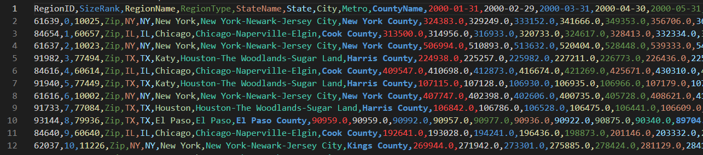
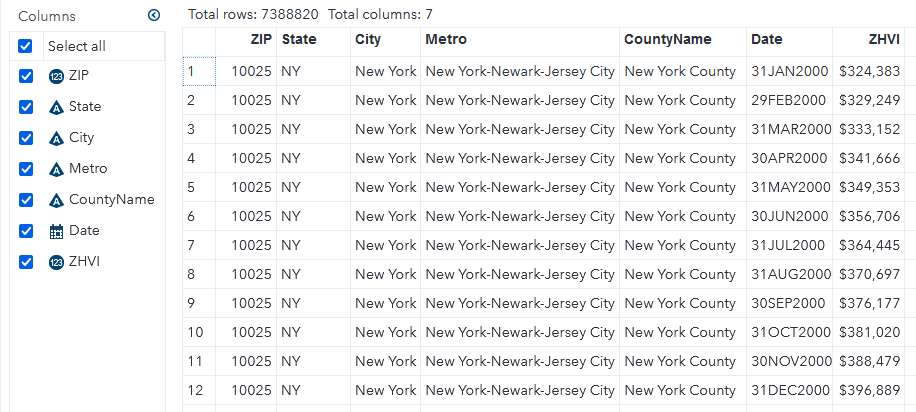

Zillow is a well-known website widely used by those searching for a home or curious to find out 
the value of their current home. What you may not know is that Zillow has a dedicated research page. 
To make their website work optimally, they churn through tons of data on the American housing market.
They share insights they gleaned via [zillow.com/research](https://www.zillow.com/research/). If you
visit their research  website you'll notice they have a data page where you can download some really
cool data sets for your own research. They even have an API with which you can load data directly, but
you'll have to register for access. In this post, we'll look at how to load the CSV files that are
available for direct download into SAS for analysis.

The CSV files can be downloaded [here](https://www.zillow.com/research/data/). In the example below,
I'm working with the Zillow Home Value Index file for all homes, seasonally adjusted at the ZIP code level.
Tha file is fairly large. It has data going from January 2000 through June 2022 in more than 27,000 rows of data
and about 280 columns. Below is an image of the beginning of this file.



When working with large CSV files, I find it useful to get a feel for it in the CLI with 
[csvkit](https://csvkit.readthedocs.io/en/latest/index.html). This is especially important when importing
with a SAS data step, because we need to know the number of columns and their order, amongst other things,
for our code. To get an overview of the total number of columns and their contents, run

```bash
csvcut -n Zip_zhvi_uc_sfrcondo_tier_0.33_0.67_sm_sa_month.csv
```

The output is fairly long, so you may prefer piping to a pager. I don't need all the different identifiers 
in the file, so I'm going to exclude those I won't need and put them into a separate, smaller CSV.

```bash
# ignore these four columns which I won't need
csvcut -C RegionID,SizeRank,RegionType,StateName Zip_zhvi_uc_sfrcondo_tier_0.33_0.67_sm_sa_month.csv > Zip_zhvi_small.csv
# alternatively, also cut down on date columns to only 2022 for debugging 
csvcut -C RegionID,SizeRank,RegionType,StateName,10-273 Zip_zhvi_uc_sfrcondo_tier_0.33_0.67_sm_sa_month.csv > Zip_zhvi_small.csv
```

You can also reduce the file size by using `csvgrep` to filter any of the columns. For example, if we only wanted 
the data for North Carolina we could run `csvgrep -c State -m NC` in the pipe.

For SAS, we need to know the maximum length of string columns so we can allocate the appropriate length to the 
corresponding SAS variables. This is easily done with the csvstat tool:

```bash
csvcut -c Metro,City,CountyName Zip_zhvi_small.csv | csvstat --len
```

You can also specify the list of columns in csvstat directly, but in my experience that tends to be slower. 


Alright, now we have everything we need to start on our DATA step! We start with the attribute statement. 
One problem with importing this file is that everyhing is in wide format, with the dates used as headers.
We will get around this shortly. I have seen people use transpose etc for similar problems online, but this
is unnecessary if we feel comfortable with the DATA step. We'll start by naming the identifying columns 
just as in the CSV file. For the date columns, we will use a numeric range prefixed by date (`date1-date270`). 
You can use csvcut to find the exact number of date columns you have. We will also allocate the same number of 
columns for the ZHVI values, so we'll need to add a `val1-val270`. This and the date variable are temporary
and will be dropped later, in favor of the `Date` and `ZHVI` variables.

```SAS
attrib 
    ZIP           informat=best12.    format=z5.
    State         informat=$2.
    City          informat=$30.
    Metro         informat=$42.
    CountyName    informat=$29.
    date1-date270 informat=YYMMDD10.  format=DATE9.
    val1-val270   informat=best16.
    Date                              format=Date9.
    ZHVI                              format=Dollar16.
  ;
```

Now we will allocate an array to hold _all_ of the date and ZHVI values during the processing of each row.
Since the date column won't change, we'll tell SAS to retain its values.

```SAS
   retain date1-date270;
   array d(270) date1-date270;
   array v(270) val1-val270;
```

This is where the magic happens now. You may not know it, but you are not limited to a single INPUT statement
in a DATA step. We use this and start by reading in only the first row. Because we use an OUTPUT 
statement later, this reading of row 1 will be processed, but not saved into the output data set.

```SAS
if _n_ = 1 then do;
  input ZIP $ State $ City $ Metro $ CountyName $ date1-date270;
  PUT _ALL_; /* if you want to see what that looks like */
end;
```
With this if clause, the date1 through date270 variables will be populated, and because we used a retain
statement earlier, these values remain available to us during the processing of every other row. You can 
probably guess where this is going now: we will process each row, and then OUTPUT one line per date which 
we have access to now thanks to our array and the retain statement.

```SAS
input ZIP $ State $ City $ Metro $ CountyName $ val1-val270;
do i=1 to 270;
  Date  = d(i); /* look up date for column i */
  ZHVI =  v(i); /* use the corresponding i-th value for ZHVI */
  OUTPUT;       /* This output creates one line per date column */
end;
```

At the end of your data step, don't forget to 

```SAS
drop i date1-date270 val1-val270;
```

so those variables don't clutter your data set. And that's it! You now 
have the data set loaded and available in SAS.


