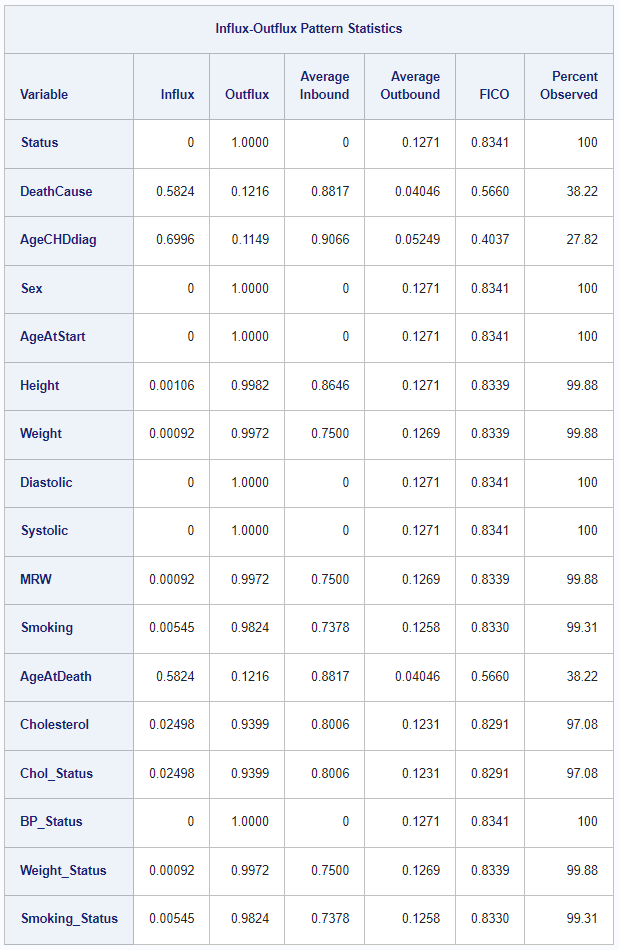

The [Viya 2024.04 release](https://go.documentation.sas.com/doc/en/pgmsascdc/v_050/pgmsaswn/n1l6ng10yj6s1an1v0rt9nj79ktc.htm)
includes a brand new MI feature: new missing data statistics. An important
choice when building an imputation model is the selection of variables to be
included. One method to help in the variable selection process is the usage of
summary statistics such as influx and outflux, as proposed by [van
Buuren](https://stefvanbuuren.name/fimd/missing-data-pattern.html). In his
words: "Influx and outflux are summaries of the missing data pattern intended to
aid in the construction of imputation models. Keeping everything else constant,
variables with high influx and outflux are preferred. Realize that outflux
indicates the potential (and not actual) contribution to impute other variables"

The MI statement now supports the new FLUX option. When specified, MI produces a table
including the influx, outflux, average inbound and outbound, and FICO statistics
along with a column indicating the percent of cases for which the particular
variable has been observed. When ODS graphics are turned on, MI additionally
produces a scatter plot of the variables' influx and outflux. For details,
see the new section on [Missing Data Statistics](https://go.documentation.sas.com/doc/en/pgmsascdc/v_050/statug/statug_mi_details57.htm) in the MI chapter of the SAS/STAT User's Guide.

One thing that's cool about this new feature for all users, not just those interested
in multiple imputation, is the fact that this new feature allows you to get a
complete overview of the percent of observed/missing cases for _all_ variables ---
both character and numeric! Previously, you either needed to use
[separately procedures](https://blogs.sas.com/content/iml/2011/09/19/count-the-number-of-missing-values-for-each-variable.html) for character and numeric variables, or [expend some work](https://www.sas.com/content/dam/SAS/en_ca/User%20Group%20Presentations/TASS/Zdeb-MissingData.pdf) to get a macro written that creates a table
of both types of variables for you.

With this new feature, you can simply use

```sas
/* optional: creates output ds with PctObs and PctMiss vars */
ods output Flux=Flux;

/* sample code using the sashelp.heart data set */
proc mi data=sashelp.heart flux
      nimpute=0
      displaypattern=nomeans;
   class _character_;
   var _all_;
   fcs;
run;
```
Note that we can include all variables in our data set with `var _all_`. If our
data set includes character variables, we need `class _character_` to label all
character variables as classification variables. If you are only interested in
a subset of the variables, you can of course specify them here. We use the FCS
statement to accomodate classification variables and we set `nimpute=0` since we
don't actually want to create imputations, just view the missing data statistics.
The `ods output` statement is completely optional. It creates a data set with
variables PctObs and PctMiss for every variable in the analysis that you could
then further process with PROC SQL or some other method.

In this example, the table will look as follows:



For a full walkthrough of this code, see the [new example](https://go.documentation.sas.com/doc/en/pgmsascdc/v_050/statug/statug_mi_examples19.htm)
in the MI chapter of the SAS/STATS User's Guide.