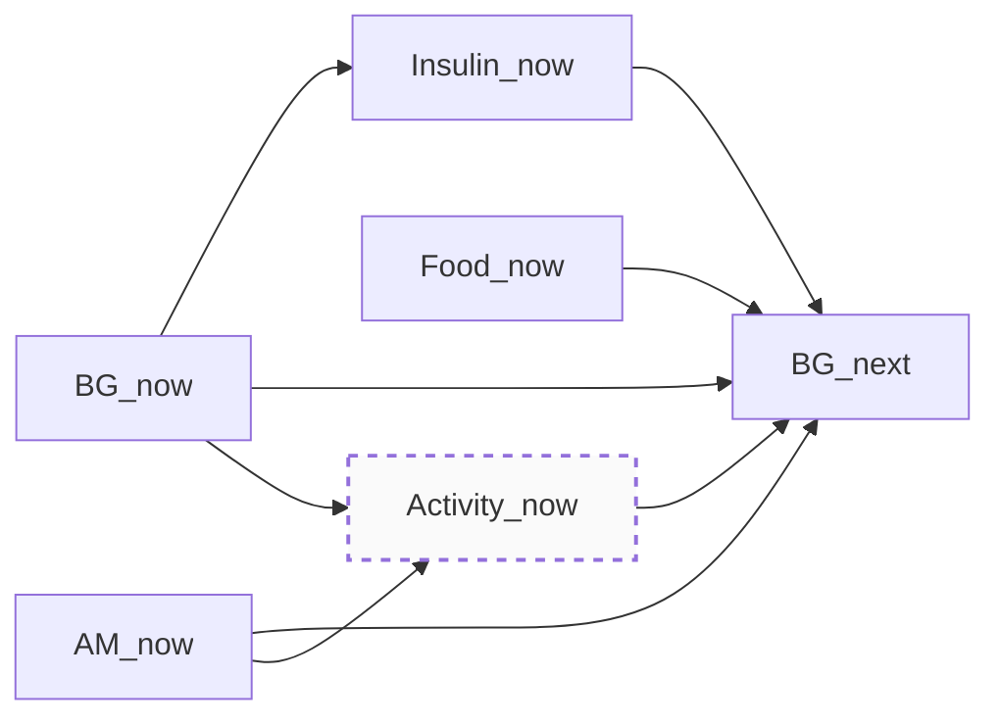
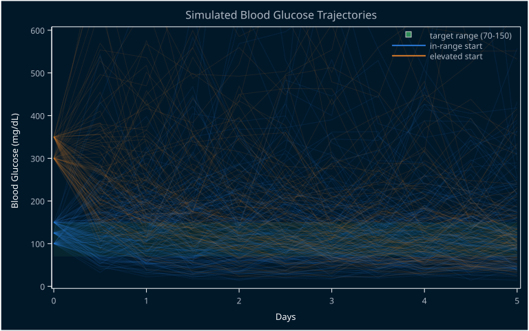
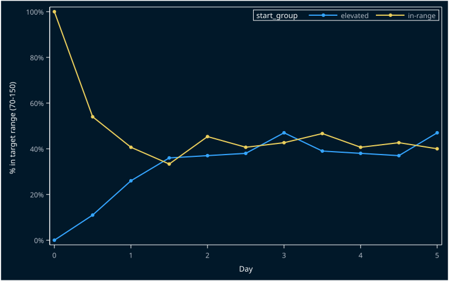
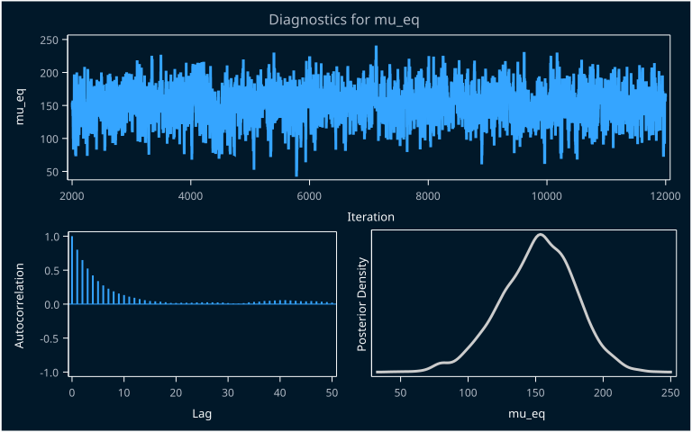
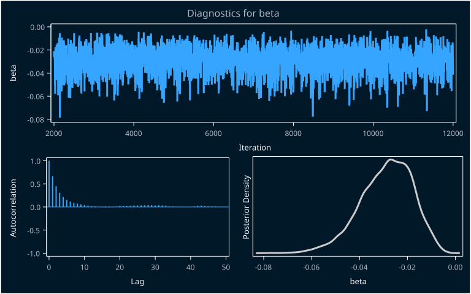
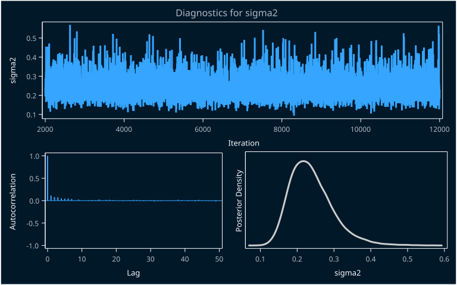
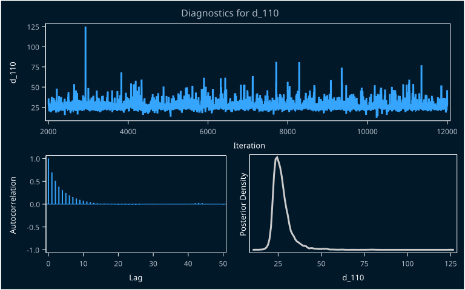
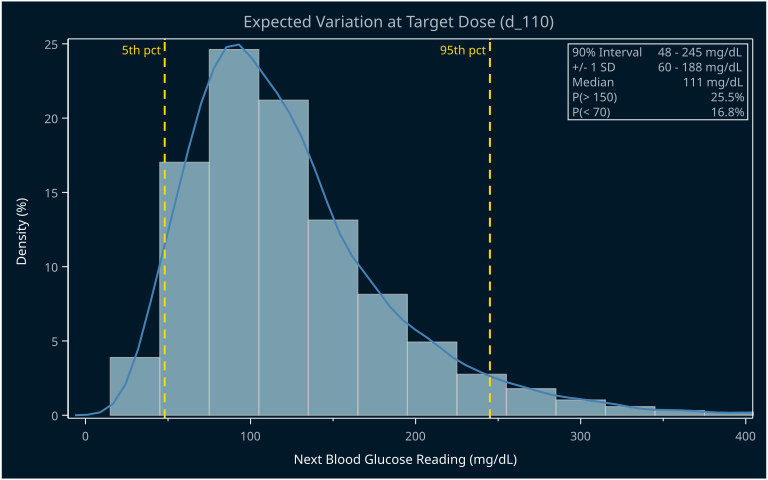

My dog Sudo has diabetes. In humans, that is quite manageable. Constant monitoring of blood sugar levels and insulin dosage is required, but many tools exist to help with this and -- importantly -- are covered by medical insurance. The situation with dogs tends to be more challenging. Fewer tools are available and many people don't have medical insurance for their dogs. According to our local vet, this unfortunately leads to many dogs being euthanized instead of cared for. Care for the dogs themselves is more challenging as well. The process for establishing Sudo's dose was as follows: for about two weeks, he wore a continuous glucose monitor (CGM) and we recorded his blood sugar levels. We then used that data to determine his insulin dosage. We settled on one specific dog food that he would get the same amount twice a day, every day so that his carb intake stays stable. We administer insulin twice a day with his food. The vet used that data to generate a dosing table. Most people apparently just use a fixed dose twice daily, because some dogs are not particularly fond of blood sugar sticks and CGM is expensive. Sudo has been doing well with the blood sugar pricks, so we have generally been able to use adjustment doses as recommended.

We have noticed lately that his blood sugar has been running high. Ideally, it should roughly stay in the range of 70-150 mg/dL. Once it starts dropping much lower than this, he needs immediate sugar because hypoglycemia can be fatal. If he strays far above this level, he is at risk for long-term complications due to damage from hyperglycemia. For the past months we've noticed he hasn't been responding to his insulin as well as he used to. We've started adjusting his dose slightly based on his blood sugar readings, but we are concerned that this is not a sustainable approach. We've been collecting data to share with his vet in coming up with a new strategy, but this is also a good excuse to learn about the basics of autoregression.

## The Model Basics

So how does blood sugar work for purposes of our model? Let's start with a simple DAG. Sudo gets Vetsulin doses and food twice a day, approximately 12 hours apart, and we take a blood sugar reading at the same time we administer each dose. It's easiest to think of this as a forward-looking process: his blood sugar *now*, together with the insulin dose given *now* and the food eaten *now*, causes his blood sugar at the *next* reading, 12 hours later. The current dose itself is chosen from a sliding-scale table based on the current reading, so blood sugar now also causes the current dose. His current blood sugar and the time of day (AM vs. PM) affect his activity level, which in turn affects the next reading. Activity is hard to fully monitor, so I'll consider it an unmeasured variable for purposes of our model. Food is fixed -- same food, same amount, every time -- so it doesn't vary and will fall out of the estimating equation, but it's worth keeping in the DAG for completeness.

Putting it together, we have the following DAG:



A quick call to PROC CAUSALGRAPH lets us know if the causal effect of insulin on blood sugar is identifiable from this DAG.

```sas
proc causalgraph;
  ods select AdjustList;
  model 'Sudo'
    BG_now --> Insulin_now --> BG_next,
    BG_now --> BG_next,
    Food_now --> BG_next,
    AM_now --> BG_next,
    AM_now --> Activity_now,
    BG_now --> Activity_now --> BG_next;
  unmeasured Activity_now;
  identify Insulin_now --> BG_next;
run;
```

<div class="table-wrap">
<table>
<caption>Covariate Adjustment Sets for Sudo — Causal Effect of Insulin_now on BG_next</caption>
<thead>
<tr><th>Set</th><th>Size</th><th>Minimal</th><th>AM_now</th><th>BG_now</th><th>Food_now</th></tr>
</thead>
<tbody>
<tr><td>1</td><td>1</td><td>Yes</td><td></td><td>✓</td><td></td></tr>
<tr><td>2</td><td>2</td><td>No</td><td>✓</td><td>✓</td><td></td></tr>
<tr><td>3</td><td>2</td><td>No</td><td></td><td>✓</td><td>✓</td></tr>
<tr><td>4</td><td>3</td><td>No</td><td>✓</td><td>✓</td><td>✓</td></tr>
</tbody>
</table>
</div>

The good news -- yes, it is identifiable! And quite simply, too. The minimal adjustment set for `Insulin_now` consists of just `BG_now`. Index the sequence of 12-hour readings by $i = 0, \dots, n-1$. At each reading we observe blood sugar $y_i$ and administer dose $d_i$ concurrently, per the sliding-scale table. The DAG says $y_{i+1}$ -- the *next* reading -- depends on $y_i$ and $d_i$ from *now*. This is a simple autoregressive model of order 1, or AR(1), just written so that everything on the right-hand side is contemporaneous and the model looks one step forward:

$$
\begin{align}
  y_{i+1} &\sim N(\mu_{i+1}, \sigma)\\
  \mu_{i+1} &= \alpha + \beta d_i + \gamma y_i
\end{align}
$$

where $y_{i+1}$ is the blood sugar reading at the next time point, $d_i$ is the insulin dose given now, and $y_i$ is the blood sugar reading now. The parameters $\alpha$, $\beta$, and $\gamma$ represent the intercept, the effect of the insulin dose, and the effect of the current blood sugar reading, respectively. The parameter $\sigma$ represents the standard deviation of the blood sugar readings.

## Finding Reasonable Priors

Blood glucose is strictly positive, and insulin's effect plausibly behaves multiplicatively rather than additively. In other words, a given dose should produce a roughly consistent *percentage* change in blood sugar, not a fixed mg/dL drop regardless of level. Modeling $\log(y)$ instead of $y$ handles both facts at once: it enforces positivity by construction (a linear-Normal model has support on all of $\mathbb{R}$, so no amount of prior-tightening fully rules out negative glucose), and it makes $\beta$ a roughly-multiplicative dose effect. So we'll write the model as:

$$
\begin{align}
  \log(y_{i+1}) &\sim N(\mu_{i+1}, \sigma)\\
  \mu_{i+1} &= \alpha + \beta d_i + \gamma \log(y_i)
\end{align}
$$

Putting priors directly on  $\alpha$, $\beta$, and $\gamma$ can be tricky because they're not very interpretable on their own. Instead, I'll reason about the blood sugar equilibrium $\mu_{eq}$ given a constant maintenance dose $d_{ref}$, and derive $\alpha$ from that: $\alpha = \log(\mu_{eq})(1-\gamma) - \beta \, d_{ref}$.

From here, some folks advocate for generic "uninformative" priors. But that's not a good idea here. Magnitudes for the parameters are constrained and not all are equally likely. For our model, for example, we require $\gamma < 1$ in order to get an equilibrium value. A prior that doesn't lead to an equilibrium is not really sensible.

So now that we know we don't want uniform priors or really wide normals, let's construct some reasonable priors. I like running simulations to generate a decent idea of what is sensible. Here are the priors I've come up with and why:

- $\mu_{eq} \sim N(110, 30)$. This is centered on the vet's stated healthy target range (70-150 mg/dL).
- $\gamma \sim \text{Beta}(8, 3)$. The mean around 0.73 is chosen to reflect Vetsulin's published duration of action (roughly 14-24 hours), which implies meaningful carryover across a 12-hour gap.
- $\beta \sim -\text{Gamma}(4, 0.01)$. Insulin reliably lowers blood sugar, but with modest magnitude, since I don't have any hard data to pin this with yet. Flip the sign on the Gamma to make it look right.
- $\sigma^2 \sim \text{iGamma}(6,0.9)$. This is a hard one to set. We don't have strong outside information here, so this is mostly a placeholder: wide enough to allow for real day-to-day variation, tight enough that the implied dynamics don't look absurd.

The real test of whether these priors are sensible is whether they produce sane qualitative behavior. If we hold the dose fixed at Sudo's maintenance dose and simulate forward, readings that start in his target range should mostly stay there, and an elevated reading should decay back down over a few days rather than staying stuck or resolving in a single implausible step.



Elevated readings appear to decay downwards and in-range start seems roughly to stay there. Nothing sticks out in particular. Let's check for convergence of the two readings, which we would expect in an autoregression model such as ours.



That's the behavior we're looking for and that's good enough for a start. The two groups converge. The rate of those staying in-range is modest, but that's fine for this purpose. The main goal is to rule out _unreasonable_ guesses and remove support from them so that the data can meaningfully move our priors to sensible values.

## Fitting The Data

Alright, now that we have a model and priors available, let's fit the data. I have a week's worth of blood sugar and insulin dose recordings for Sudo, which is enough to get a rough idea of the dynamics. (The full SAS script behind this post, including the code that produced every figure, is available as [`sudo.sas`](sudo.sas) if you'd like to follow along or run it yourself.) The data is read in via `datalines`, which has the following columns:

```sas
data sudo_glucose;
    length DOSEWIN $2;
    input DATE : MMDDYY10. DOSEWIN $ GLUCOSE DOSE;
    period_index = _N_;
    label
        DATE    = "Observation Date"
        DOSEWIN = "Dosing Window (AM/PM)"
        GLUCOSE = "Blood Glucose (mg/dL)"
        DOSE    = "Vetsulin Dose (Units)";

    format DATE MMDDYY10.;

    datalines;
08/24/2026 AM 371  0.0
08/24/2026 PM 500 30.0
08/25/2026 AM 416 28.0
08/25/2026 PM 310 26.0
08/26/2026 AM 280 27.0
08/26/2026 PM 170 23.0
08/27/2026 AM 298 25.0
08/27/2026 PM 264 26.0
08/28/2026 AM 128 22.0
08/28/2026 PM 164 23.0
08/29/2026 AM  95 22.0
08/29/2026 PM 231 24.0
08/30/2026 AM 143 23.0
08/30/2026 PM 116 22.5
08/31/2026 AM 192 23.0
08/31/2026 PM 298 24.0
09/01/2026 AM 119 23.0
;
run;
```

Which creates this data set:

<div class="table-wrap">
<table>
<caption>Sudo Glucose Data</caption>
<thead>
<tr><th>Observation Date</th><th>Dosing Window (AM/PM)</th><th>Blood Glucose (mg/dL)</th><th>Vetsulin Dose (Units)</th></tr>
</thead>
<tbody>
<tr><td>08/24/2026</td><td>AM</td><td>371</td><td>0.0</td></tr>
<tr><td>08/24/2026</td><td>PM</td><td>500</td><td>30.0</td></tr>
<tr><td>08/25/2026</td><td>AM</td><td>416</td><td>28.0</td></tr>
<tr><td>08/25/2026</td><td>PM</td><td>310</td><td>26.0</td></tr>
<tr><td>08/26/2026</td><td>AM</td><td>280</td><td>27.0</td></tr>
<tr><td>08/26/2026</td><td>PM</td><td>170</td><td>23.0</td></tr>
<tr><td>08/27/2026</td><td>AM</td><td>298</td><td>25.0</td></tr>
<tr><td>08/27/2026</td><td>PM</td><td>264</td><td>26.0</td></tr>
<tr><td>08/28/2026</td><td>AM</td><td>128</td><td>22.0</td></tr>
<tr><td>08/28/2026</td><td>PM</td><td>164</td><td>23.0</td></tr>
<tr><td>08/29/2026</td><td>AM</td><td>95</td><td>22.0</td></tr>
<tr><td>08/29/2026</td><td>PM</td><td>231</td><td>24.0</td></tr>
<tr><td>08/30/2026</td><td>AM</td><td>143</td><td>23.0</td></tr>
<tr><td>08/30/2026</td><td>PM</td><td>116</td><td>22.5</td></tr>
<tr><td>08/31/2026</td><td>AM</td><td>192</td><td>23.0</td></tr>
<tr><td>08/31/2026</td><td>PM</td><td>298</td><td>24.0</td></tr>
<tr><td>09/01/2026</td><td>AM</td><td>119</td><td>23.0</td></tr>
</tbody>
</table>
</div>

We'll need to use SQL with a self-join to generate the analysis data set from here. We'll need an extra column for the following row's glucose reading and we can drop the dosing window since we don't need it.

```sas
proc sql;
    create table sudo_analysis as
    select
        now.period_index,
        now.DATE,
        now.DOSEWIN,
        now.GLUCOSE as BG_now    label="Blood Glucose Now (mg/dL)",
        now.DOSE    as DOSE_now  label="Vetsulin Dose Now (Units)",
        nxt.GLUCOSE as BG_next   label="Blood Glucose Next Reading (mg/dL)"
    from sudo_glucose as now
    left join sudo_glucose as nxt
        on nxt.period_index = now.period_index + 1
    order by now.period_index;
quit;
```

This gives us the analysis data set as:

<div class="table-wrap">
<table>
<thead>
<tr><th>Observation Date</th><th>Blood Glucose Now (mg/dL)</th><th>Vetsulin Dose Now (Units)</th><th>Blood Glucose Next Reading (mg/dL)</th></tr>
</thead>
<tbody>
<tr><td>08/24/2026</td><td>371</td><td>0.0</td><td>500</td></tr>
<tr><td>08/24/2026</td><td>500</td><td>30.0</td><td>416</td></tr>
<tr><td>08/25/2026</td><td>416</td><td>28.0</td><td>310</td></tr>
<tr><td>08/25/2026</td><td>310</td><td>26.0</td><td>280</td></tr>
<tr><td>08/26/2026</td><td>280</td><td>27.0</td><td>170</td></tr>
<tr><td>08/26/2026</td><td>170</td><td>23.0</td><td>298</td></tr>
<tr><td>08/27/2026</td><td>298</td><td>25.0</td><td>264</td></tr>
<tr><td>08/27/2026</td><td>264</td><td>26.0</td><td>128</td></tr>
<tr><td>08/28/2026</td><td>128</td><td>22.0</td><td>164</td></tr>
<tr><td>08/28/2026</td><td>164</td><td>23.0</td><td>95</td></tr>
<tr><td>08/29/2026</td><td>95</td><td>22.0</td><td>231</td></tr>
<tr><td>08/29/2026</td><td>231</td><td>24.0</td><td>143</td></tr>
<tr><td>08/30/2026</td><td>143</td><td>23.0</td><td>116</td></tr>
<tr><td>08/30/2026</td><td>116</td><td>22.5</td><td>192</td></tr>
<tr><td>08/31/2026</td><td>192</td><td>23.0</td><td>298</td></tr>
<tr><td>08/31/2026</td><td>298</td><td>24.0</td><td>119</td></tr>
<tr><td>09/01/2026</td><td>119</td><td>23.0</td><td>.</td></tr>
</tbody>
</table>
</div>

With analysis data in tow, we can now specify the model in MCMC and fit it to the data. The MCMC code is fairly straight forward. One thing that is cool is that we can directly use our draws to calculate the implied target dose $d_{110}$ for a target blood glucose of 110 mg/dL inside the MCMC code with the `beginnodata` and `endnodata` blocks. By adding this value to the `monitor` option we get its distribution added to the `post` data set.

```sas
proc mcmc data=sudo_analysis(where=(not missing(BG_next)))
          outpost=post nbi=2000 nmc=10000 seed=42 monitor=(mu_eq beta sigma2 d_110);
    ods exclude Parameters Nobs;

    parms mu_eq 110 gamma 0.7 sigma2 0.4;
    parms beta_mag 0.04; /* Track the positive magnitude */

    prior mu_eq    ~ normal(110, sd=30);
    prior gamma    ~ beta(8, 3);
    prior beta_mag ~ gamma(4, scale=0.01); /* Strictly positive prior */
    prior sigma2   ~ igamma(shape=6, scale=0.9);

    d_ref     = 22;
    logBGnow  = log(BG_now);
    logBGnext = log(BG_next);

    /* Flip the sign so beta is strictly negative */
    beta = -beta_mag;

    alpha = log(mu_eq) * (1 - gamma) - beta * d_ref;
    mu    = alpha + gamma * logBGnow + beta * DOSE_now;

    model logBGnext ~ normal(mu, var=sigma2);

    beginnodata;
        d_110 = d_ref + (1-gamma)/beta * log(110/mu_eq);
    endnodata;
run;
```

<div class="table-wrap">
<table>
<caption>Posterior Summaries and Intervals</caption>
<thead>
<tr><th>Parameter</th><th>N</th><th>Mean</th><th>Standard Deviation</th><th>95% HPD Lower</th><th>95% HPD Upper</th></tr>
</thead>
<tbody>
<tr><td>mu_eq</td><td>10000</td><td>128.2</td><td>26.3122</td><td>76.1145</td><td>176.8</td></tr>
<tr><td>beta</td><td>10000</td><td>-0.0289</td><td>0.0109</td><td>-0.0500</td><td>-0.00937</td></tr>
<tr><td>sigma2</td><td>10000</td><td>0.1889</td><td>0.0560</td><td>0.0992</td><td>0.2985</td></tr>
<tr><td>d_110</td><td>10000</td><td>23.7539</td><td>3.0840</td><td>19.1590</td><td>31.1369</td></tr>
</tbody>
</table>
</div>
<div class="table-wrap">
<table>
<caption>Effective Sample Sizes</caption>
<thead>
<tr><th>Parameter</th><th>ESS</th><th>Autocorrelation Time</th><th>Efficiency</th></tr>
</thead>
<tbody>
<tr><td>mu_eq</td><td>1321.2</td><td>7.5690</td><td>0.1321</td></tr>
<tr><td>beta</td><td>1833.6</td><td>5.4537</td><td>0.1834</td></tr>
<tr><td>sigma2</td><td>8499.6</td><td>1.1765</td><td>0.8500</td></tr>
<tr><td>d_110</td><td>1601.2</td><td>6.2454</td><td>0.1601</td></tr>
</tbody>
</table>
</div>









Overall we see pretty good mixing. We only have a small number of data points, so we're looking for pointers in this data -- not publishable results.

```sql
select
    mean(mu_eq > 110) as prob_mu_eq_above_110 label="P(μ_eq > 110)",
    mean(mu_eq > 150) as prob_mu_eq_above_150 label="P(μ_eq > 150)"
    from post;
```

<div class="table-wrap">
<table>
<thead>
<tr><th>P(μ_eq > 110)</th><th>P(μ_eq > 150)</th></tr>
</thead>
<tbody>
<tr><td>0.7577</td><td>0.2069</td></tr>
</tbody>
</table>
</div>

It appears we have good reason to believe that we have an equilibrium mean above 110 mg/dL, but only modest grounds to believe it is above 150 mg/dL. In part that's because we don't have that much data, so the prior isn't overwhelmed yet. But that's the point of it, we're updating. Our model still has uncertainty, as the next visualization shows and there's a decent chance of an out-of-range reading (roughly a third).




Overall, this is good intuition building and shows support for some of the ideas my wife and I have discussed as we have been monitoring Sudo. Next steps from a modeling perspective would be to get more data points to help sharpen the uncertainty windows. With enough data points, I think it would be worthwhile to build a hierarchical model with the dose window effect.
